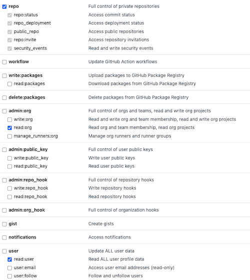

This project is is dedicated to the Go GenAI Studio application that is a a fork of the LibreChat: https://github.com/danny-avila/LibreChat and modified and customized to our needs.

This system has support for the latest flash and pro model of Gemini. Supports Grounding with both Google Search and Vertex AI Search.

# Go GenAI Studio - Local Environment

## Setup Minikube

You need to setup minikube once. After this was done once, you can simply start it.

```bash
brew install minikube

minikube start                   # if you see a message to use a different port than the default port 5000, you can ignore the message
minikube addons enable registry
minikube addons enable ingress   # see https://minikube.sigs.k8s.io/docs/handbook/addons/ingress-dns/#Mac


kubectl config use-context minikube
kubectl create namespace go-genai-studio-local
kubectl config set-context --current --namespace go-genai-studio-local

```

## RAG API Image

note down your minikube ip with `minikube ip`

add `"insecure-registries": ["192.168.49.2:5000"]` to your `~/.docker/daemon.json` (macOS) or `C:\ProgramData\Docker\config\daemon.json` (Windows)

```
cd YOUR_WORKSPACE
git clone https://gitlab.com/goreplyde/internal/internal-projects/go-genai-studio-rag-api.git
cd go-genai-studio-rag-api
eval $(minikube docker-env)
docker build -t $(minikube ip):5000/go-genai-studio-rag-api:bdae521a .
docker push $(minikube ip):5000/go-genai-studio-rag-api:bdae521a
```

## Start Application

### Create Secrets

- Go to demo.goreply.de console [here](https://console.cloud.google.com/iam-admin/serviceaccounts/details/105650602806534171764/keys?inv=1&invt=AbkfOg&project=go-de-genai-demo) and create your own key
- Download the key and rename it to `key.json`
- Execute `kubectl create secret generic gcp-service-account --from-file=./key.json`

### Start surrounding services

```bash
cd YOUR_WORKSPACE/go-genai-studio/k8s/minikube

# please exchange all occurrences of "192.168.49.2" with your minikube ip (echo $(minikube ip))

kubectl apply -f secret.yaml -f env.yaml -f vectordb.yaml -f rag.yaml -f mongodb.yaml -f meilisearch.yaml

bash ./port_forwarding.sh # this should run in terminal session #1 and you should wait a bit before running this command so that all instances are up and running
```

### Start the app locally

Open 2 new terminal sessions

```bash
cp .env.example .env
npm run reinstall           # this takes a while, needs to be run once
npm run build:data-provider
npm run frontend:dev        # run this in terminal session #2
npm run backend:dev         # run this in terminal session #3
```

Now you can access the app under localhost:3090.

### Add service account for local setup

Once logged in to the application, you need to link a service account in order to use the different models.

If you don't have a service account setup yet, you should register a new one (e.g. me-test@goreply.de).

ℹ️ Note: This needs to be repeated whenever the database is cleared.

Do the following to create a service-account.json file, used for the upload later on:

```bash
cd service-account
./create_service_account.sh
```

Follow the instructions and use your goreply demo account for authentication.
A json file will be created.
In your browser, you can now open the provider dropdown at the top-left-hand-side, hover over a provider (e.g. Google) and click on "Set API Key". Now upload the json file you just created.
Afterwards you can use the chat.

# Go GenAI Studio - Remote Environment


1. Adjust variables in terragrunt.hcl files inside [environments](./environment)
2. Set environment with `appl` or `export env=prod`
3. Run Terraform with `make init && make plan && make apply`

**Common errors during first terraform executions:**

* `Error creating Secret: googleapi: Error 403`: This error happens because it takes some time for the APIs be becode available. Please execute plan and apply again
* `Error waiting to create Connection: Error waiting for Creating Connection: Error code 9, message: could not access secret`: Please set `module.cloudbuild_v2.create_connection` to `false`, run apply again and then set it to true again
* `Error waiting to create Connection: Error waiting for Creating Connection: Error code 3, message: secret "projects/go-de-genai-studio/secrets/<ENVIRONMENT>-go-genai-studio-github-oauth/versions/latest" not found`: Follow these steps:
  * Generate a [new GitHub token access (classic)](https://github.com/settings/tokens/new) with the user `go-de-genai-studio` (credentials can be found in Bitwarden) that includes these following scopes: `repo`, `read:user` und `read:org`
  
  * Put the token as a new version in the `<ENVIRONMENT>-go-genai-studio-github-oauth` secret in Google Cloud Secret Manager [here](https://console.cloud.google.com/security/secret-manager)

* Please restart the terraform plan and apply once again.

4. Build and deploy RAG API

```
cd YOUR_WORKSPACE
export GCP_PROJECT_NAME=go-de-genai-studio
export GCP_ARTIFACTORY_REPO_NAME=go-de-dev-go-genai-studio #see terraform output "repo_name"
git clone https://gitlab.com/goreplyde/internal/internal-projects/go-genai-studio-rag-api.git
cd go-genai-studio-rag-api
docker build --platform linux/amd64 -t europe-west3-docker.pkg.dev/$GCP_PROJECT_NAME/$GCP_ARTIFACTORY_REPO_NAME/rag:bdae521a .
docker push europe-west3-docker.pkg.dev/$GCP_PROJECT_NAME/$GCP_ARTIFACTORY_REPO_NAME/rag:bdae521a
```

5. Create a OAuth ClientID following this
   
6. Open up [GCP Secrets Manager](https://console.cloud.google.com/security/secret-manager) and fill-in all secrets with a prefix e.g. "go-de-dev-go-genai-studio-"

- For CREDS, JWT and MEILI please generate new secrets [here](https://www.librechat.ai/toolkit/creds_generator)
- For POSTGRES\* please provide any new values
- For GOOGLE_CLIENT_ID and GOOGLE_CLIENT_SECRET, you can find the credentials in the console from [here](https://console.cloud.google.com/apis/credentials)
- SONAR_LOGIN needs to be generated from [here](https://sonarqube.goreply.de/account/security) (please log in using the credentials in BitWarden) 
- SONAR_HOST refers to the URL that allows access to the SonarQube instance. So in our case it’s https://sonarqube.goreply.de/
- For OPENAI_API_KEY, please use the API Key stored in our BitWarden (search for “GPT API Key for GenAI Studio Team”)

7. Trigger a deployment through running a CloudBuild (see [in the console](https://console.cloud.google.com/cloud-build/triggers))
8. Set DNS record to the generated IP (see [in the console](https://console.cloud.google.com/networking/addresses/list))
9. Wait until the TLS certificate gets provisioned (check with `kubectl describe ManagedCertificate genai-studio-managed-cert-dev | grep Status`)

# Backup & Restore

## Backup

1. `kubectl cp $(kubectl get pods -l app=mongodb -o jsonpath='{.items[0].metadata.name}'):/data/db ./mongodb_bck/`
2. `kubectl cp $(kubectl get pods -l app=meilisearch -o jsonpath='{.items[0].metadata.name}'):/meili_data ./meili_data_bck/`
3. `kubectl cp $(kubectl get pods -l app=vectordb -o jsonpath='{.items[0].metadata.name}'):/var/lib/postgresql/data ./pgdata_bck/`

## Restore

1. Activate maintenance page (`kubectl patch service api-service -p '{"spec":{"selector":{"app":"maintenance-page"}}}'`)
2. Scale down all deployments:

```
kubectl scale --replicas=0 deployment/vectordb-prod
kubectl scale --replicas=0 deployment/rag
kubectl scale --replicas=0 deployment/meilisearch
kubectl scale --replicas=0 deployment/mongodb
kubectl scale --replicas=0 deployment/api
```

    - name: test-pvc-mount-pgdata
      mountPath: /mnt/pgdata
    - name: test-pvc-meilisearch-claim0
      mountPath: /mnt/meilisearch-claim0
    - name: test-pvc-mongodb-claim0
      mountPath: /mnt/mongodb-claim0

3. Create [testpod](.k8s/testpod.yaml) with every pvc (`kubectl get pvc`) and execute copy commands
   1. `kubectl apply -f ./k8s/testpod.yaml`
   2. `kubectl cp ./mongodb_bck/ testpod:/mnt/mongodb-claim0` , then `kubectl exec -it testpod -- sh` and `mv /mnt/mongodb-claim0/mongodb_bck/* /mnt/mongodb-claim0/ && rm -rf /mnt/mongodb-claim0/mongodb_bck/`
   3. `kubectl cp ./meili_data_bck/ testpod:/mnt/meilisearch-claim0`, then `kubectl exec -it testpod -- sh` and `mv /mnt/meilisearch-claim0/meili_data_bck/* /mnt/meilisearch-claim0/ && rm -rf /mnt/meilisearch-claim0/meili_data_bck/`
   4. `kubectl cp ./pgdata_bck/ testpod:/mnt/pgdata`, then `kubectl exec -it testpod -- sh` and `mv /mnt/pgdata/pgdata_bck/* /mnt/pgdata/ && rm -rf /mnt/pgdata/pgdata_bck/`
4. Scale up all deployments:

```
kubectl scale --replicas=1 deployment/vectordb-prod
kubectl scale --replicas=1 deployment/rag
kubectl scale --replicas=1 deployment/meilisearch
kubectl scale --replicas=1 deployment/mongodb
kubectl scale --replicas=1 deployment/api
```

5. Deactivate maintenance page (`kubectl patch service api-service -p '{"spec":{"selector":{"app":"api"}}}'`)

# SonarQube
## Documentation
You can find all the relevant information on how to configure SonarQube in our Confluence.
The Documentation can be found here: https://goreplyde.atlassian.net/wiki/spaces/GOR/pages/2940502076/Code+Quality+with+SonarQube
